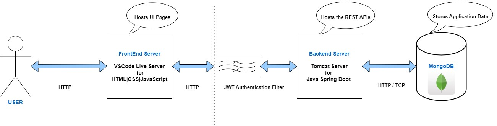

# Fit365 - FitnessTracker Web Application
<h3>Created as part of FSAD Assignment</h3>

<h3>Introducing Fit365!</h3>

- Fit365, a Fitness Tracker Web Application, is the all-in-one fitness tracker designed to elevate the wellness journey of all fitness enthusiasts.
- With secure user authentication, users can effortlessly register and log in to embark on their path to better health. 
- Users can tailor their experience with profile updates and access pre-designed workout plans to suit their fitness level and goals. 
- They can Log activities, Set Personalized Fitness goals, and Track Progress visually, empowering them in their fitness journey throughout.

<h3>Features</h3>

- **User Authentication**	
Registration & Login of users with JWT Authentication
- **User Profile Updation**	
Updating of user details
- **Workout Plans**	
Offer pre-designed workout plans tailored to user preferences
- **Activity Logging**	
Enables users to log [Duration | Steps | Calories Burnt] of various fitness activities
- **Goal Setting**	
Provides users with ability to set personalized fitness goals for parameters such as Calories Burnt and Steps Covered
- **Progress Tracking**	
Displays visual representations of user’s progress towards their goals

<h3>Architecture Diagram</h3>

